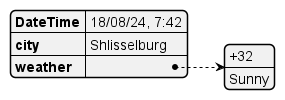
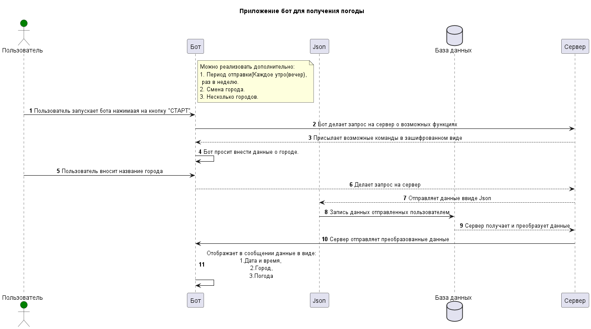

# Разработка Бота погоды как учебный проект

## Подробное описание и цель.

**Описание:**

Разработка телеграм-бота ведется  в учебных целях который можно считать как пет-проектом и на будущее можно использовать как open source. Так же это мне больше поможет погрузиться в разработке на языке программирования Python.

**Цель:**

Бот разрабатывается для получения информации о погоде в мессенджере Telegram. на будущее планируется реализации на таких платформах как Дискорд, Вконтакте.

## **Основные требования:**

Язык программирования: Python.

Библиотеки которые будут применены: aiogram.

## **Основной функционал:**

Кто может пользоваться: Все.

Пользователь в мессенджере телеграм нажимает на клавиатуру "Старт", бот поприветсвует по имени который внесен в телеграм и в зависимости времени дня.

Например:

Доброе(ый) утро(день, вечер, ночь) {имя пользователя}.

После приветствия попросит ввести город по которому будет получать данные по погоде. Бот автоматически запоминает в базу данных все данные внесенные пользовтаелем. 

Такие как:

1. Имя и UID пользователя
2. Введенный город.

Так же опционально будут добавлены такие данные как получать погоду по времени, наприер в 8 утра каждый день(будни, в выходные).

Все данные храняться в формате Json в виде:

Полная схема работы приложения описана в блок-схеме:

## В планах:

1. Добавление получение данных о погоде в нескольких городах.
2. Автоматически получение времени по часовому поясу города.
